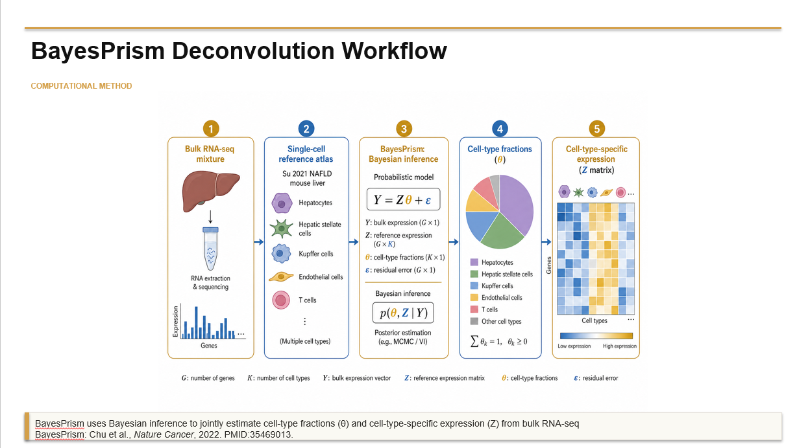
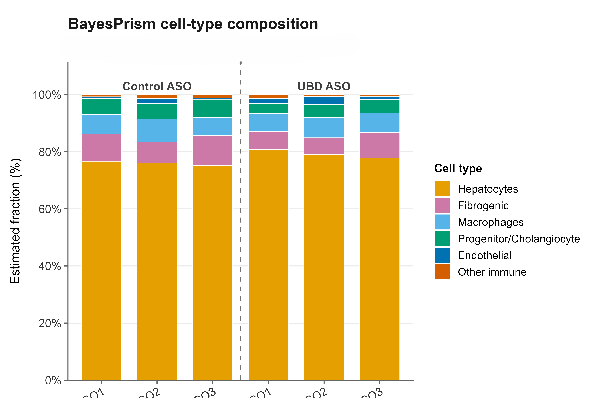
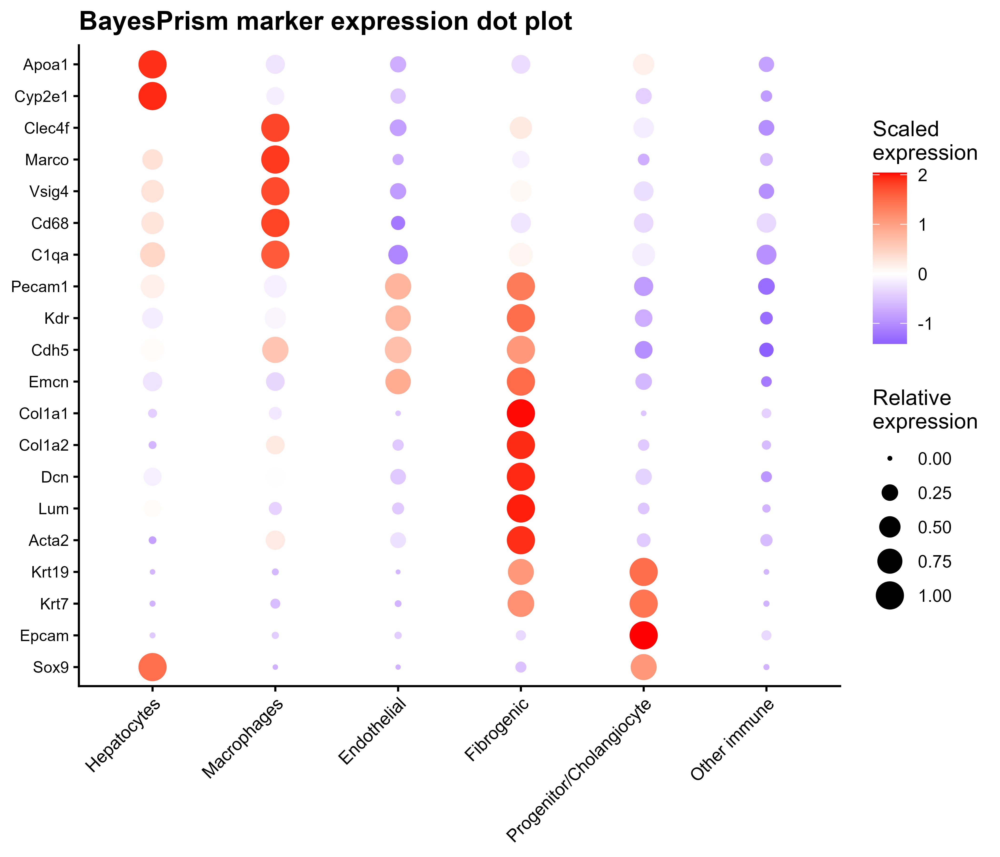
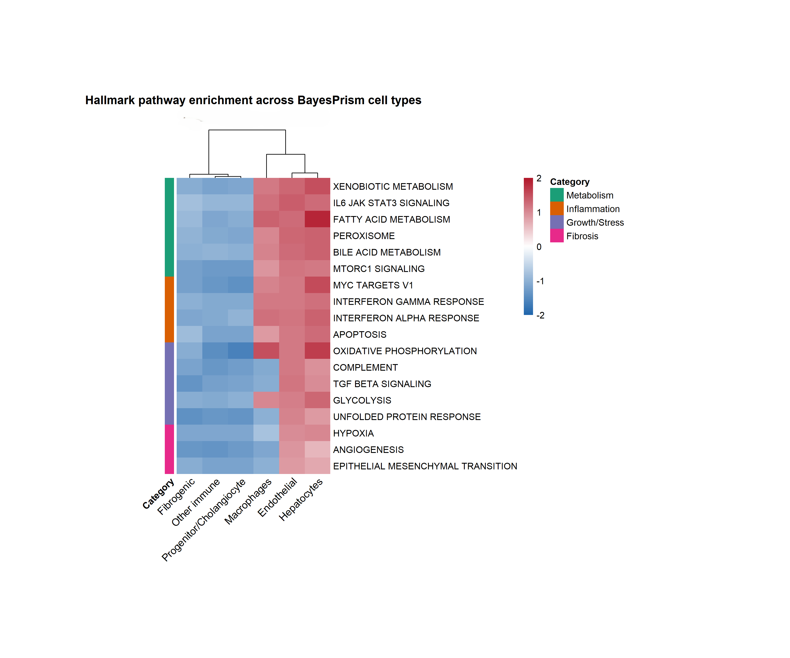

# BayesPrism Deconvolution Pipeline

A reproducible R workflow for cell-type deconvolution of bulk RNA-seq data using BayesPrism and single-cell reference atlases.

This repository provides an end-to-end framework for:

- Reference preparation
- BayesPrism deconvolution
- Cell-type fraction estimation
- Marker validation
- Cell-type-specific differential expression analysis
- Gene set enrichment analysis (GSEA)
- Publication-quality visualization

---

# Workflow Overview

The analysis begins with bulk RNA-seq expression profiles and a single-cell reference atlas. BayesPrism is used to infer both cellular composition and cell-type-specific expression programs.



---

# Example Results

## Cell-Type Composition

BayesPrism estimates the contribution of each cell type to every bulk RNA-seq sample.



---

## Marker Validation

Canonical marker genes can be used to validate inferred cell identities and assess biological consistency of deconvolution results.



---

## Pathway Enrichment Analysis

Gene Set Enrichment Analysis identifies pathways associated with cell-type-specific transcriptional changes.



---

# Repository Structure

```text
BayesPrism-Deconvolution-Pipeline/

├── scripts/
│   ├── 01_prepare_reference.R
│   ├── 02_run_bayesprism.R
│   ├── 03_fraction_analysis.R
│   ├── 04_marker_validation.R
│   ├── 05_differential_expression.R
│   ├── 06_gsea_analysis.R
│   └── 07_visualization.R
│
├── example_data/
│   ├── example_bulk_expression.csv
│   ├── example_reference_metadata.csv
│   └── README.md
│
├── figures/
│   ├── workflow.png
│   ├── fraction_plot.png
│   ├── marker_validation.png
│   └── gsea_heatmap.png
│
├── docs/
│   ├── methodology.md
│   └── install.md
│
├── README.md
├── LICENSE
└── .gitignore
```

---

# Analysis Workflow

## 1. Reference Preparation

Prepare bulk RNA-seq counts and single-cell reference matrices.

```r
source("scripts/01_prepare_reference.R")
```

Outputs:

- Processed bulk expression matrix
- Processed reference matrix
- Cell-type labels
- Sample metadata

---

## 2. BayesPrism Deconvolution

Run Bayesian deconvolution using BayesPrism.

```r
source("scripts/02_run_bayesprism.R")
```

Outputs:

- Cell-type fractions
- Posterior expression estimates
- BayesPrism model object

---

## 3. Cell-Type Fraction Analysis

Compare inferred cell-type fractions across experimental groups.

```r
source("scripts/03_fraction_analysis.R")
```

Outputs:

- Statistical comparisons
- Fraction summaries
- Composition plots

---

## 4. Marker Validation

Evaluate expression of canonical marker genes across inferred cell populations.

```r
source("scripts/04_marker_validation.R")
```

Outputs:

- Marker expression tables
- Dot plots
- Validation figures

---

## 5. Differential Expression

Perform cell-type-specific differential expression analysis using limma.

```r
source("scripts/05_differential_expression.R")
```

Outputs:

- Differential expression statistics
- Ranked gene files
- Summary tables

---

## 6. Gene Set Enrichment Analysis

Run pathway enrichment analysis using fgsea and MSigDB gene sets.

```r
source("scripts/06_gsea_analysis.R")
```

Outputs:

- Hallmark pathways
- Reactome pathways
- GO Biological Process pathways
- Enrichment summaries

---

## 7. Visualization

Generate publication-quality figures from deconvolution, differential expression, and pathway analyses.

```r
source("scripts/07_visualization.R")
```

Outputs:

- Composition figures
- Differential expression summaries
- Pathway enrichment visualizations

---

# Installation

Install required packages:

```r
install.packages(c(
  "dplyr",
  "tidyr",
  "readr",
  "ggplot2",
  "limma",
  "fgsea",
  "msigdbr"
))
```

Install BayesPrism:

```r
remotes::install_github("Danko-Lab/BayesPrism")
```

---

# Input Requirements

### Bulk RNA-seq

Gene-by-sample count matrix:

| GeneSymbol | Sample1 | Sample2 | Sample3 |
|------------|---------|---------|---------|
| GeneA | 120 | 95 | 110 |
| GeneB | 34 | 41 | 39 |

### Single-Cell Reference

Gene-by-cell expression matrix:

| GeneSymbol | Cell1 | Cell2 | Cell3 |
|------------|-------|-------|-------|
| GeneA | 12 | 8 | 10 |
| GeneB | 4 | 6 | 5 |

Cell identities are supplied through cell-type labels.

---

# Outputs

The pipeline generates:

- Cell-type fraction estimates
- Cell-type-specific expression profiles
- Differential expression results
- Ranked gene lists
- GSEA pathway enrichment results
- Publication-quality figures

---

# Citation

If you use BayesPrism in your research, please cite:

> Chu T, Wang Z, Pe'er D, Danko CG.
>
> Cell type and gene expression deconvolution with BayesPrism enables Bayesian integrative analysis across bulk and single-cell RNA sequencing.
>
> Nature Cancer (2022)

---

# License

Distributed under the MIT License.
